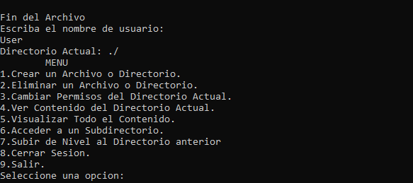
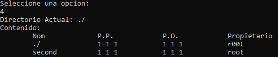
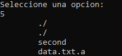

# File & Directory Storage
This program was made to use Object Oriented classes and a tree structure to save and read the data, along with user permissions to write, read and execute.

This program reads a file from the computer, every change made before closing the program will be saved there. After starting the program and reading the file, the content will be shown. Then it'll ask for the username and will drop a menu with the functions that can be made in the program. This is shown in the following image:

## Program Functions
The functions of this program are described here:
1. Create a File or Directory:

   This will allow you tho choose between file or directory on the actual directory. If the file name is available the file will be created.
2. Delete a File or Directory:

    If the given name exists and the user has permissions, this will remove the file or directory.
3. Change Actual Directory Permissions:

    If the user has the permissions, the actual directory read, execute and write permissions can be changed.
4. Show Actual Directory Content:

    It will show a list containing only the files and directories on the current directory. It will also show Owner Permissions (P.P.), Other Users Permissions (P.O.) and Owner Name. The permissions are shown in the following order: Reading, Writing, Executing.
    
    
5. Show All the Content:

    It will show just a list of every file or directory stored on the text file.
    
    
6. Access to Subdirectory:

    Allows the user to change to a created directory that are stored on the current one.
7. Go back to Previous Directory:

    If the user has entered a directory this will allow to go to the previous directory. If the user is located on the root directory this won't do anything.
8. Sign out:

    It will sign out the user and allow to enter with a new username.
9. Exit Program:

    This will save the changes made previously, writing the data on the file and then the program will be closed.
